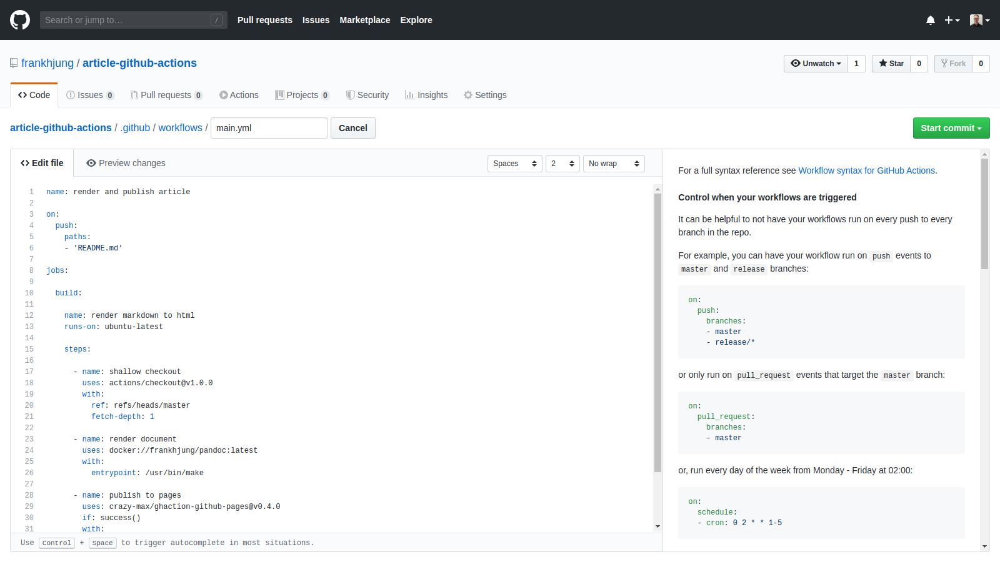

In the
[previous](https://github.com/frankhjung/article-git-pipelines/blob/master/README.md)
article on [Git
pipelines](https://marlo.com.au/a-short-introduction-to-git-pipelines/), we
mentioned that [GitHub](https://github.com) had release a *beta* of
[Actions](https://github.com/features/actions). In this article we will take a
quick look at some of the new features offered by Actions. We will use the same
example of rendering this article into HTML. Although this example is limited it
does demonstrate the basic features. Since this is a *beta* release and still in
a state of flux, we will only compare this against the previous Azure pipeline
project.

To recap, the workflow is:

1. Install [GNU Make](https://www.gnu.org/software/make/)
1. Install [pandoc](https://pandoc.org/) which is used to render Markdown into HTML
1. Render the HTML document from Markdown
1. Archive HTML document

The Actions based workflow is similar, but simpler. It performs the following
tasks:

1. Get latest commit of repository
1. Render the HTML document from Markdown
1. Publish rendered HTML document to [GitHub pages](https://pages.github.com/)

This differs from the previous workflow, in that we don't need to install
dependent software. Instead we can use prepared Docker Hub images. Also, we will
publish the HTML to GitHub pages rather than offering an archive to download.

A rendered version of this article can be found here,
[frankhjung.github.io/article-github-actions](https://frankhjung.github.io/article-github-actions/README.html).


#### What are GitHub Actions?

Actions introduce integrated pipelines called *workflows* into a GitHub
repository. That means we can access workflows directly from GitHub's dashboard
by the  tab. When we were preparing this
article, the job history in the Actions tab did not show until *after* we had
published to the `master` branch.

From the Actions tab we can view job history as well as view, edit or add
workflows:


#### What are GitHub Workflows?

[Workflows](https://help.github.com/en/articles/configuring-a-workflow#about-workflows)
define the automation steps of a pipeline. Workflows are stored in the
`.github/workflows` directory at the root of your project. A workflow has one or
more jobs that contains a sequence of tasks called *steps*. As an example, lets
work through this projects workflow, which is listed below:

```yaml
name: render and publish article            # (1)

on:                                         # (2)
  push:
    paths:
    - 'README.md'

jobs:                                       # (3)

  build:                                        ## (4)

    name: render markdown to html               ## (5)
    runs-on: ubuntu-latest                      ## (6)

    steps:                                      ## (7)

      - name: shallow checkout                      ### (8)
        uses: actions/checkout@v1.0.0               ### (9)
        with:                                       ### (10)
          ref: refs/heads/master
          fetch-depth: 1

      - name: render document                       ### (11)
        uses: docker://frankhjung/pandoc:latest
        with:
          entrypoint: /usr/bin/make

      - name: publish to pages                      ### (12)
        uses: crazy-max/ghaction-github-pages@v0.4.0
        if: success()                               ### (13)
        with:
          build_dir: public
        env:                                        ### (14)
          GITHUB_TOKEN: ${{ secrets.GH_PAGES_TOKEN }}
```

There are three major sections to a workflow **(1)** - **(3)**:

##### (1) name

A workflow has a name. This name will appear as a title on the dashboard.

##### (2) on

This describes how this workflow gets triggered. There are multiple ways that a
workflow can be triggered:

1. on push or pull request on branch or tag
1. on push or pull request on a path
1. on a [schedule](https://help.github.com/en/articles/workflow-syntax-for-github-actions#onschedule)

Here, we are experimenting by being triggered by a push on file changes to
`README.md`.

##### (3) jobs

Jobs contain steps for execution. The bulk of a workflow appears under this jobs
(3) section. These components are explained in the following sections,
**(4)-(14)**.

##### (4) id

Jobs are given a unique id. Here, we have labelled it `build`.

##### (5) name

Jobs have a name which will appear on GitHub.

##### (6) runs-on

Jobs are
[run](https://help.github.com/en/articles/workflow-syntax-for-github-actions#jobsjob_idruns-on)
on GitHub hosted virtual machine images. The choices support these three
principle [virtual
environments](https://help.github.com/en/articles/virtual-environments-for-github-actions):

  1. `Ubuntu`
  1. `Windows Server`
  1. `macOS X`.

Apart from `latest` there are a choice of versions for each virtual environment.
The limitation here is that you must use one of these images. If you are
invoking Docker based Actions, then you must use a Linux image. These Docker
images also must run as `root`, which could be problematic. For example,
[Haskell Stack](https://docs.haskellstack.org) will complain when installing
dependencies with a user of different privileges.

##### (7) steps

The remainder of the job is composed of
[Steps](https://help.github.com/en/articles/workflow-syntax-for-github-actions#jobsjob_idsteps).
Steps are the workhorse of workflows. Steps can run setup tasks, run commands
or run actions. Our workflow performs three tasks named:

1. shallow checkout
1. render document
1. publish to pages

##### (8) checkout

Previously with Azure pipeline we did only needed to specify how the pipeline
was triggered. It was assumed that the code was already checked out. With
Actions this step is explicit. We need to invoke an action to checkout from
GitHub. The benefit is that you can finely tune how and what to checkout. In the
example action, (8), we are performing a shallow checkout (depth of 1 commit) from
the master branch.

##### (9) uses

To perform the checkout we are using the standard [checkout
action](https://github.com/actions/checkout). It is recommended that you specify
a specific version (rather than a general tag like `@latest`. When we were
reviewing actions, it was helpful and instructive to view the source code to
check whether the action provided the required features. For instance we able to
trial three different actions to publish our content.

##### (10) with

Some actions require parameters. These are provide using the `with` clause. In
this case (10) we are supplying specific checkout information. In other examples
(11), we are overriding the default entry point of the Docker container, or
specifying the directory location to publish, (12). Each Action can define its
own values or defaults so it pays to read the source to determine the available
choices for the specific version being used.

##### (11) using custom Docker

Custom Docker containers can be called as Actions. In this example we are
calling a prepared image with all the tools used for rendering this project from
markdown to HTML.

##### (12) publish pages

In our previous article we rendered markdown to HTML and provided it as a
archive to download. A better solution is to publish static content to [GitHub
Pages](https://pages.github.com/). This required the creation of an access token
which is nicely described
[here](https://help.github.com/en/enterprise/user/articles/creating-a-personal-access-token-for-the-command-line).
This token is then added to the project as a **Secret** under **Settings**. The
token `GH_PAGES_TOKEN` is passed to the action so it is able to publish the
rendered static HTML page to the
[gh_pages](https://github.com/frankhjung/article-github-actions/tree/gh-pages)
branch.

##### (13) if

[If](https://help.github.com/en/articles/workflow-syntax-for-github-actions#jobsjob_idstepsif)
can conditionally execute a step. The [conditional
expression](https://help.github.com/en/articles/contexts-and-expression-syntax-for-github-actions)
can be a Boolean expression or a GitHub context. If the condition is true, the
step will execute. In our example it uses a context to check the status of the
previous step.

##### (14) secrets

[Secrets](https://help.github.com/en/articles/virtual-environments-for-github-actions#creating-and-using-secrets-encrypted-variables)
are encrypted environment variables. They are restricted for use in Actions.
Here, we store the token required to publish to [GitHub
Pages](https://help.github.com/en/categories/github-pages-basics).


#### Putting it all together

We now have all the pieces in place to execute a workflow that will:

1.  Invoke an action to perform a shallow checkout of our repository from the `master` branch
1.  Render the markdown using a custom Action from our own [pandoc Docker](https://cloud.docker.com/u/frankhjung/repository/docker/frankhjung/pandoc) container
1.  Use a public Action to publish the static HTML to [GitHub pages](https://frankhjung.github.io/article-github-actions/README.html)

That is not all though. As workflows are now integrated to GitHub, we can review
jobs and even edit or add new ones:


#### Some Extras

##### Workflow Logs

Job runs are recorded. You can review a job by following the link from **Workflow
runs**. This will show a run history like:


Each job step has logs that can be viewed and/or downloaded.


##### Editing a Workflow

GitHub provides an online editor for your workflow:



However, this editor does not currently validate the workflow. So, why is it
even provided as it offers nothing that normal online editing does?


#### Our Impression

Our first impression of actions is that they are a definite improvement over the
former Azure pipelines:

* Integrated into GitHub
* Active [marketplace](https://github.com/marketplace) for
  [Actions](https://developer.github.com/marketplace/#github-actions) and
  [Apps](https://developer.github.com/marketplace/#apps). See a comparison
  between Actions and Apps
  [here](https://developer.github.com/marketplace/actions/comparing-actions-and-apps/).
* Good documentation
* Able to use custom Docker images
* Fast workflows

However, there are also some drawbacks:

* There is no cache between jobs. The current recommended practice is to archive
  the required data, and then restore the archive on the required job.
  To do this you will require to execute Actions.
* Actions can be invoked by running a Docker container. Containers can be pulled
  from remote sources. However, the recommended practice is to [write actions in
  JavaScript](https://help.github.com/en/articles/about-actions#types-of-actions)
  since these actions are performed on the GitHub host, and do not need to be
  pulled from external sources. JavaScript is not the first language DevOps
  would use to build workflow pipelines. Will GitHub Actions support other
  languages in the future?
* Docker Actions are of variable quality. We spent time experimenting with
  different variations until we found those that matched our requirements. As
  the source code is available it was easy to evaluate an Actions
  implementation. Or, you could simply write your own following these
  [instructions](https://help.github.com/en/articles/building-actions). We also
  found that we could use our existing Docker images without modification.

We further explored Actions building a [Haskell
](https://github.com/frankhjung/haskell-gcd) project. Our expectation was that
having to use GitHub virtual machines to manage a workflow would be slow.
Consider what this means for our Haskell project above. A naïve first approach
was to use a custom [Haskell
Docker](https://cloud.docker.com/u/frankhjung/repository/docker/frankhjung/haskell)
image which contains all required build tools. However, GitHub requires you to
run Docker containers as `root`. This caused issues for
[Stack](https://www.haskellstack.org) when installing in project dependencies,
as Stack won't update your cache as `root`. Instead we were forced to install
Stack into GitHub's supplied virtual machine. And as there is no cache available
in GitHub, this means we would need to:

* Download and install Haskell Stack (unable to use custom Docker image)
* Download and recompile all dependencies (no cache)
* Rebuild our entire project (no cache)
* Download and run another Docker image to publish static content

Surprise! Even with this compromised workflow, GitHub was still faster than the
equivalent pipeline on an alternate Git repository. The pages were also
immediately available! On other Git repositories we have seen long delays when
publishing pages.

There are some good features to GitHub Actions which are easily composed. While
JavaScript is not the fist tool we would consider as a workflow language, Docker
is very workable compromise, even with a small performance hit.


#### Resources

* [Actions: Automating your workflow](https://help.github.com/en/categories/automating-your-workflow-with-github-actions)
* [Actions: Creating a Docker Container](https://developer.github.com/actions/creating-github-actions/creating-a-docker-container/)
* [Actions: Deploy Static Content to GitHub Pages](https://github.com/marketplace/actions/deploy-to-github-pages-for-static-site-generator)
* [Actions: Environment Variables](https://help.github.com/en/articles/virtual-environments-for-github-actions#environment-variables)
* [Actions: GitHub Pages by CrazyMax](https://github.com/marketplace/actions/github-pages)
* [Actions: Help](https://github.com/actions)
* [Article: About Actions](https://help.github.com/en/articles/about-actions)
* [Article: Workflow Syntax for GitHub Actions](https://help.github.com/en/articles/workflow-syntax-for-github-actions)
* [GitHub Pages Basics](https://help.github.com/en/categories/github-pages-basics)
* [Repository: github-actions](https://github.com/frankhjung/article-github-actions)
* [Repository: git-pipelines](https://github.com/frankhjung/article-git-pipelines)

<p class="site-info"/>
