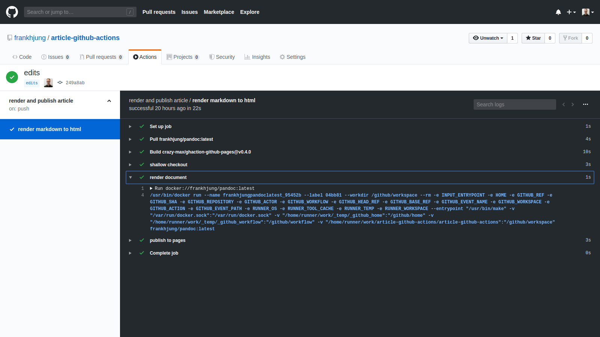

# Introduction

In our [earlier article on Git
pipelines](https://marlo.com.au/a-short-introduction-to-git-pipelines/), we
mentioned that [GitHub](https://github.com) had released a *beta* of
[Actions](https://github.com/features/actions), their latest CI/CD workflow
automation tool. Let's take a quick look at some of its features.

For simplicity, we'll use the same example as in the previous article - that of
rendering this article into HTML - which is more than enough to demonstrate the
basic features.

To recap, the workflow for Git pipelines was:

1. Get the latest commit in the repository
1. Install [GNU Make](https://www.gnu.org/software/make/)
1. Install [pandoc](https://pandoc.org/) which is used to render Markdown into HTML
1. Render the HTML document from Markdown
1. Archive HTML document

The Actions based workflow is similar, but quite a bit simpler. It performs the
following tasks:

1. Get latest commit in the repository
1. Render the HTML document from Markdown
1. Publish the rendered HTML document to [GitHub pages](https://pages.github.com/)

It's simpler, because we don't need to install the dependent software - we can
use pre-prepared Docker Hub images instead.


# What are GitHub Actions?

Actions introduce integrated pipelines called *workflows* into a GitHub
repository. That means we can access workflows directly from GitHub's dashboard
via the  tab. (Note that when we were
preparing this article, the job history in the Actions tab did not show until
*after* we had published to the `master` branch.)

From the Actions tab we can view job history as well as view, edit or add
workflows:


# What are GitHub Workflows?

[Workflows](https://help.github.com/en/articles/configuring-a-workflow#about-workflows)
define the automation steps of a pipeline. Workflows are stored in the
`.github/workflows` directory at the root of your project. A workflow has one or
more jobs that contains a sequence of tasks called *steps*. As an example, lets
work through this project's workflow, which is defined in the yaml file below:

```yaml
name: render and publish article            # (1) name

on:                                         # (2) on
  push:
    paths:
    - 'README.md'

jobs:                                       # (3) jobs

  build:                                        ## (4) id

    name: render markdown to html               ## (5) name
    runs-on: ubuntu-latest                      ## (6) runs-on

    steps:                                      ## (7) steps

      - name: shallow checkout                      ### (8) checkout
        uses: actions/checkout@v1.0.0               ### (9) uses
        with:                                       ### (10) with
          ref: refs/heads/master
          fetch-depth: 1

      - name: render document                       ### (11) using custom Docker
        uses: docker://frankhjung/pandoc:latest
        with:
          entrypoint: /usr/bin/make

      - name: publish to pages                      ### (12) publish pages
        uses: crazy-max/ghaction-github-pages@v0.4.0
        if: success()                               ### (13) if
        with:
          build_dir: public
        env:                                        ### (14) secrets
          GITHUB_TOKEN: ${{ secrets.GH_PAGES_TOKEN }}
```

There are three core sections to a workflow **(1)** - **(3)**:

## (1) name

A workflow has a name. This name will appear as a title on the dashboard.

## (2) on

This describes how this workflow gets triggered. There are multiple ways that a
workflow can be triggered:

1. on push or pull request on branch or tag
1. on push or pull request on a path
1. on a [schedule](https://help.github.com/en/articles/workflow-syntax-for-github-actions#onschedule)

Here, we are experimenting with being triggered by a push on file changes to
`README.md`.

## (3) jobs

Jobs contain steps for execution. The bulk of a jobs workflow appears under
section (3). These are explained in sections **(4)** to **(14)** below.

### (4) id

Jobs are given a unique id. Here, we have labelled it `build`.

#### (5) name

Jobs have a name which will appear on GitHub.

#### (6) runs-on

Jobs are
[run](https://help.github.com/en/articles/workflow-syntax-for-github-actions#jobsjob_idruns-on)
on GitHub hosted virtual machine images. The current choices offer these three
[virtual
environments](https://help.github.com/en/articles/virtual-environments-for-github-actions)
types:

  1. `Ubuntu`
  1. `Windows Server`
  1. `macOS X`.

Apart from `latest` there are a choice of versions for each virtual environment.
The limitation here is that you must use one of these images. If you are
invoking Docker based Actions, then you *must* use a Linux image. These Docker
images also must run as `root`, which could be problematic. For example,
[Haskell Stack](https://docs.haskellstack.org) will complain when installing
dependencies with a user of different privileges.

#### (7) steps

The remainder of the job is composed of
[Steps](https://help.github.com/en/articles/workflow-syntax-for-github-actions#jobsjob_idsteps).
Steps are the workhorse of workflows. Steps can run set-up tasks, run commands
or run actions. Our workflow performs three *named* tasks:

1. shallow checkout
1. render document
1. publish to pages

##### (8) checkout

Previously with Azure pipelines we only needed to specify how the pipeline was
triggered - it was assumed that the code was already checked out. With Actions
this step is explicit: that is, we need to invoke an action to checkout from
GitHub. The benefit is that you can finely tune how and what to checkout. In the
example action, (8), we are performing a shallow checkout (depth of 1 commit)
from the master branch.

##### (9) uses

To perform the checkout we are using the standard [checkout
action](https://github.com/actions/checkout). We would recommend that you specify
a specific version instead of a generic tag like `@latest`.

When we were reviewing actions, it was helpful and instructive to view the
source code to check whether the action provided the required features. For
instance, we were able to trial three different actions to publish content,
before settling on the current solution.

##### (10) with

Some actions require parameters. These are provide using the `with` clause. In
this case, (10) we are supplying specific checkout options.

Each Action can define its own values or defaults so it pays to read the source
to determine the available choices for the specific version being used.

In other examples (11), we are overriding the default entry point of the Docker
container, or specifying the directory location to publish, (12).

##### (11) using custom Docker

Custom Docker containers can be called as Actions. In this example we are
calling a prepared image with all the tools used for rendering this project from
markdown to HTML.

##### (12) publish pages

In our previous article we rendered markdown to HTML and provided it as an
archive to download. A better solution is to publish static content to [GitHub
Pages](https://pages.github.com/). This required the creation of an access token
which is nicely described
[here](https://help.github.com/en/enterprise/user/articles/creating-a-personal-access-token-for-the-command-line).
This token is added to the project as a **Settings > Secret** named
`GH_PAGES_TOKEN`. This token is passed to the action so it is able to publish
the rendered static HTML page to the
[gh_pages](https://github.com/frankhjung/article-github-actions/tree/gh-pages)
branch.

##### (13) if

[If](https://help.github.com/en/articles/workflow-syntax-for-github-actions#jobsjob_idstepsif)
can conditionally execute a step. The [conditional
expression](https://help.github.com/en/articles/contexts-and-expression-syntax-for-github-actions)
can be a Boolean expression or a GitHub context. If the condition is true, the
step will execute. In our example it uses a context to check the status of the
previous step.

##### (14) secrets

[Secrets](https://help.github.com/en/articles/virtual-environments-for-github-actions#creating-and-using-secrets-encrypted-variables)
are encrypted environment variables. They are restricted for use in Actions.
Here, we store the token required to publish to [GitHub
Pages](https://help.github.com/en/categories/github-pages-basics). See (12).


# Putting It All Together

We now have all the pieces in place to execute our workflow that will:

1.  Invoke an action to perform a shallow checkout of our repository from the `master` branch
1.  Render the markdown using a custom Action from our own
    [pandoc Docker](https://cloud.docker.com/u/frankhjung/repository/docker/frankhjung/pandoc)
    container
1.  Use a public Action to publish the static HTML to [GitHub pages](https://frankhjung.github.io/article-github-actions/README.html)

Workflows are integrated into GitHub unlike the previous Azure pipelines. A big
relief!


# Some Extras

## Workflow Logs

Job runs are recorded. You can review a job by following the link from **Workflow
runs**. This will show a run history like:



Each job step has logs that can be viewed and/or downloaded.


## Editing a Workflow

GitHub provides an online editor for your workflow:


However, this editor does not currently validate the workflow. So, why is it
even provided as it offers nothing that normal online editing doesn't?

## First Impressions

Our first impression of GitHub Actions is that they are a significant
improvement over the former Azure pipelines. Features we particularly like are:

* Actions are well integrated into GitHub
* There's an active [marketplace](https://github.com/marketplace) for
  [Actions](https://developer.github.com/marketplace/#github-actions) and
  [Apps](https://developer.github.com/marketplace/#apps). See a comparison
  between Actions and Apps
  [here](https://developer.github.com/marketplace/actions/comparing-actions-and-apps/).
* Documentation is good
* The ability to use custom Docker images
* Fast workflows

However, there are also some drawbacks:

* There is no cache between jobs. The current recommended practice is to archive
  the required data, and then restore the archive on the required job.
  To do this you will require to execute Actions. Having a local cache is really
  important for projects like Java that have many dependencies. No cache means
  downloading each and every build!
* The recommended practice is to [write actions in
  JavaScript](https://help.github.com/en/articles/about-actions#types-of-actions)
  since these actions are performed on the GitHub host, and do not need to be
  pulled from external sources. Really? JavaScript? It seems like a bizarre choice -
  JavaScript is not the first language DevOps would turn to when building
  workflow pipelines. Will GitHub Actions support other languages in the future?

We also found Docker Actions available on the
[marketplace](https://github.com/marketplace) are of variable quality. We spent
time experimenting with different variations until we found those that matched
our requirements. As the source code is available it was easy to evaluate an
Actions implementation. Or, you could simply write your own following these
[instructions](https://help.github.com/en/articles/building-actions). We also
found that we could use our existing Docker images without modification. 

There are some good features to GitHub Actions which are easily composed. While
JavaScript is not the first tool we would consider as a workflow language, Docker
is very workable compromise, even with the small performance hit.


#### Resources

* [Actions: Automating your workflow](https://help.github.com/en/categories/automating-your-workflow-with-github-actions)
* [Actions: Creating a Docker Container](https://developer.github.com/actions/creating-github-actions/creating-a-docker-container/)
* [Actions: Deploy Static Content to GitHub Pages](https://github.com/marketplace/actions/deploy-to-github-pages-for-static-site-generator)
* [Actions: Environment Variables](https://help.github.com/en/articles/virtual-environments-for-github-actions#environment-variables)
* [Actions: GitHub Pages by CrazyMax](https://github.com/marketplace/actions/github-pages)
* [Actions: Help](https://github.com/actions)
* [Article: About Actions](https://help.github.com/en/articles/about-actions)
* [Article: Workflow Syntax for GitHub Actions](https://help.github.com/en/articles/workflow-syntax-for-github-actions)
* [GitHub Pages Basics](https://help.github.com/en/categories/github-pages-basics)
* [Repository: github-actions](https://github.com/frankhjung/article-github-actions)
* [Repository: git-pipelines](https://github.com/frankhjung/article-git-pipelines)
